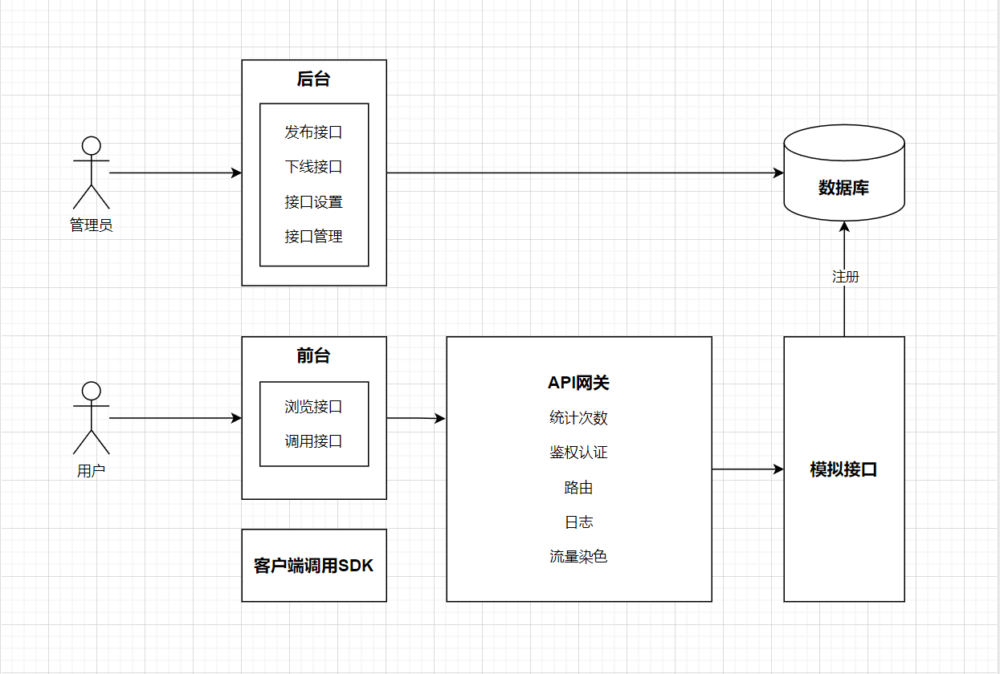
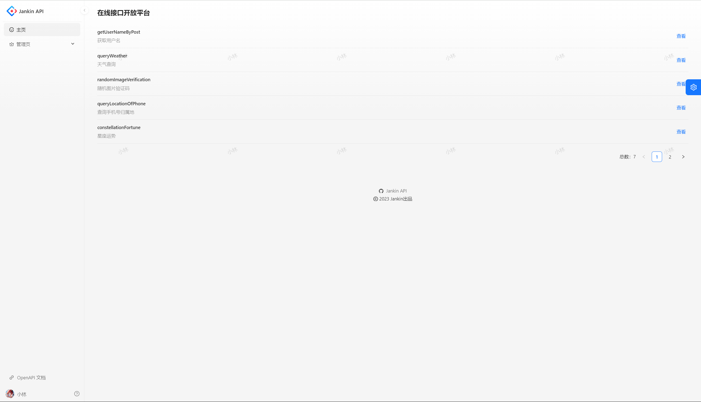
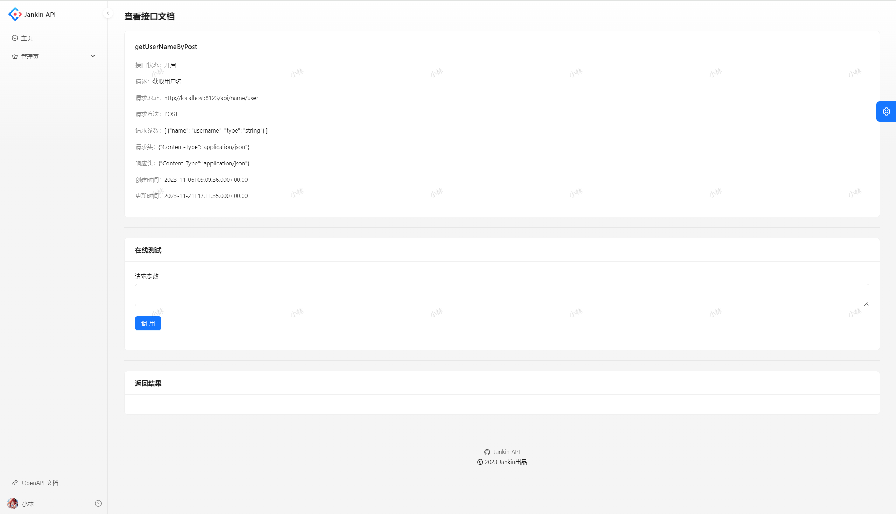
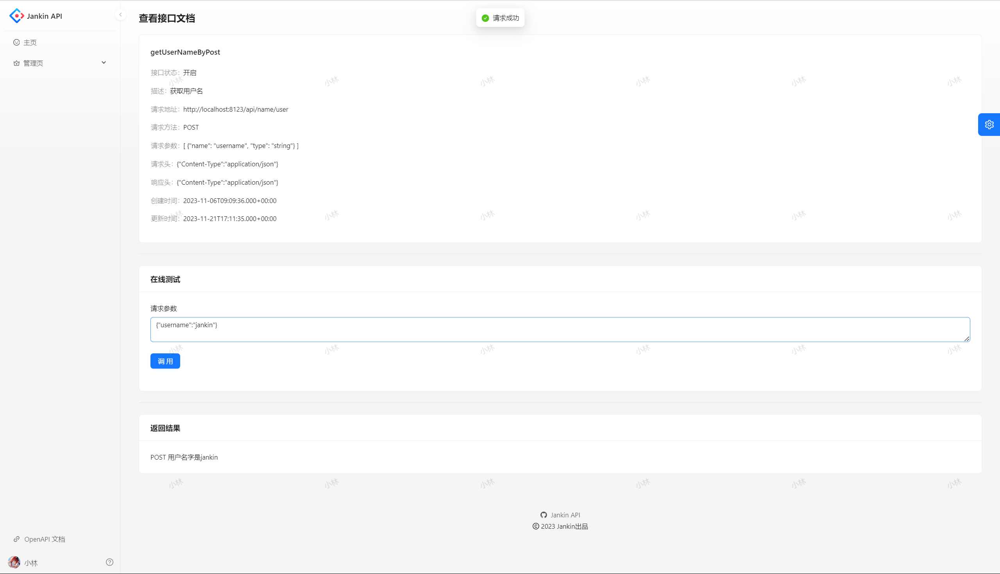
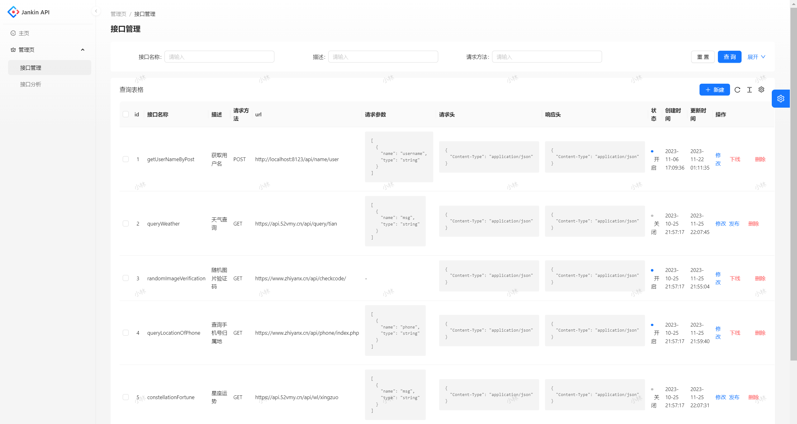
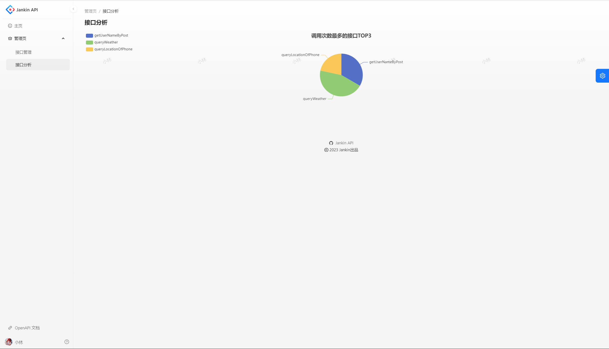

# jankin-api
基于 React + Spring Boot + Dubbo + Gateway 的 API 接口开放调用平台。管理员可以接入并发布接口，可视化各接口调用情况；用户可以开通接口调用权限、浏览接口及在线调试，并通过客户端 SDK 轻松调用接口。

### 架构图：

### 技术选型：

- Spring Boot
- Spring Boot Starter(SDK开发)
- Dubbo (RPC)
- Nacos(注册中心)
- Spring Cloud Gateway(网关、限流、日志实现)

### 启动方式：

1. 启动 Nacos、Mysql
2. 将公共服务 jankin-api-common 以及客户端 jankin-api-client-sdk 安装到本地仓库
3. 启动后端：
   - jankin-api-backend：7529端口，后端接口管理（上传、下线、用户登录）http://localhost:7529/api/doc.html
   - jankin-api-gateway：8090端口，网关
   - jankin-api-interface：8123端口，提供各种接口服务（可以有很多个且分布在各个服务器）。这里的tests有个发送请求的跑通流程的测试用例。
4. 启动前端 jankin-api-frontend （npm run start:dev）

### 项目展示：

接口展示：

接口详情：

接口测试：

接口管理：

接口分析：

